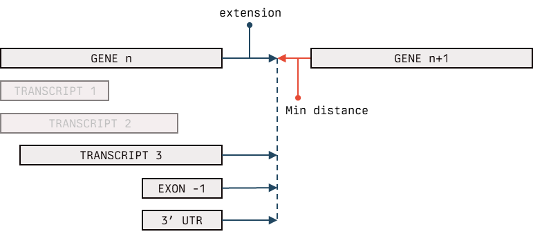

# Scope

Provided tool will add explicit 3'UTR and extends it into a valid Ensembl GTF file. 

This is a general framework to play with GTF features resembling as close as possible the biological meaning of the features annotated within a GTF file. 

A 3'UTR is added only when a protein coding transcript does not terminate with a 3'UTR and has left space between the stop codon and its end. While this is a rare case for well annotated genomes, could be real for non-model organisms and other cases. If you find a cool use case, share with me. 

The UTR extension is handled in a bit "brutal" way, where user define a maximum value for extension, which could be an integer or `max`  . The extension is done on the end of the given gene, at the end of the transcript whose end matches the gene's one (see the scheme for clarification) keeping a min distance from the next gene on the same contig. 

 **NOTE**: the extension is done only when <u>no other ORF are on the same region of a given gene.</u> For example, there's often the possibility to see a lncRNA annotated in the same region of a gene: in this case, no extension will be carried. 

## Usage

Clone the repo using 

`$ git clone https://github.com/danilotat/UTR_add_extend_GTF.git`  

Or download files manually. 
Then run the script using 

``$ ./client.py --i input.gtf --o output.gtf --length 1000 --min_dist 20`` 

To keep track of the extended transcript and the respective length, you could use the specific argument to obtain a tabular separated file 

``$ ./client.py --i input.gtf --o output.gtf --length 1000 --min_dist 20 --logs extension.log``  